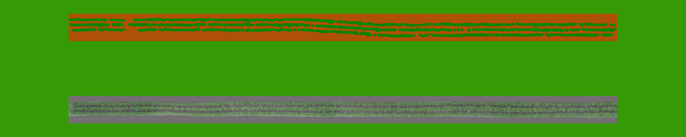

# rover-navigation

This code simulates different sensor and algorithm setups for
navigating the rover on the ACRE track shown below. The bottom line is
the straight track. The top line is the curved track. The source file
is acre.svg. 




To run a simulation use:

```
python3 navigate.py --setup line-following 
```

This will use the default algorithm -- following the line of plant in
the center of the crop bed -- on the straight section of the track.

The 'out' directory will contain all the images of the rover's camera
and additional figures.


During the simulation, the program will print out line as the following:

```
[0292] Start pos:(34.133,2.008,0.157), CTE:(0.008,0.386), ~CTE:(-0.028,-0.055), R:147.694, End Pos:(34.233,2.008,0.386)
```

The number is the iteration counter. The start position is the
position of the rover before the move command is issued
(x,y,angle). The CTE is the cross track error in distance (m) and
angle (degrees) using the target track as a reference. The ~CTE is the
cross track error as measured by the sensor. The end position is the
absolute position after the move command. Note that ~CTE is estimated
after the rover has moved but that the steering correction, based on
~CTE, is applied in the next iteration.

At the end of the simulation, the program will print out the
following:

```
Real error: mean:  [-0.01546089 -0.01299379] std:  [0.14062608 0.03260893] max:  0.1306131105492332
Estimated error: mean:  [-0.00577192 -0.00114064] std:  [0.02109628 0.03816019]
Error error: mean:  [0.00968897 0.01185315] std:  [0.13706371 0.04336916]
```

The real error is measured from the rover to the exact path. The
estimated error is the error computed by the line following
algorithm. The 'error error' shows how much 'off' the position
estimator is from the real error.


To make the rover follow the curved section of the track, run:

```
python3 navigate.py --setup line-following --track curve
```

The following setups are available:

* no-sensors: Drive straight forward without any sensor input
* perfect-sensor: Use a perfect knowledge of position
* line-following: Line following of central line of plants
* line-following-soil: Line following of soil in between rows of plants
* landmarks: Absoulte positioning using four landmarks
* track-error-particle-filter: Line following with additional particle filter
* landmarks-particle-filter: Absoulte positioning using four landmarks with additional particle filter

Run `python3 navigate.py --help` for additional command line options.


